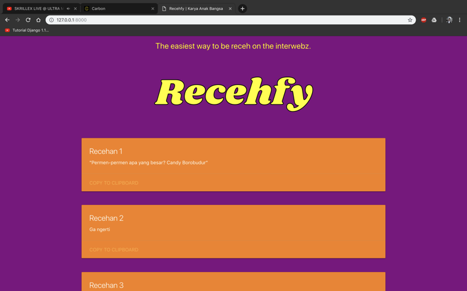
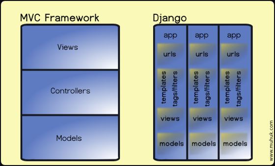
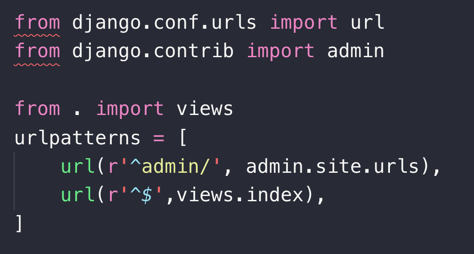
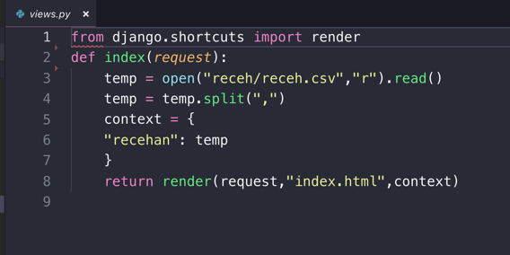
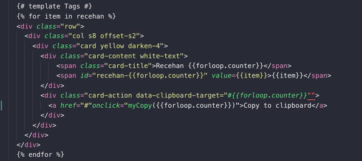

### **Latar Belakang**

Menurut [Glossaria](http://www.glosaria.com/2018/06/receh.html), **Recehan** berarti humor yang simpel tapi lucu. Recehan sering digunakan kalangan muda untuk bercanda, ataupun berjenaka bersama.

Contoh penggunaan kata:  
_“Permen, permen apa yang gede banget?”_

_“Apaan?”_

_“Candy Borobudur”_

_“Receh banget dah lo”_

### **Masalah**

Pernahkah anda mengalami sebuah situasi dimana anda sedang duduk bersama dengan teman-teman anda, lalu anda ingin sekali menyampaikan sebuah **_recehan,_** tapi anda tidak memiliki inspirasi recehan yang lucu untuk di _send_ ke teman anda?

Website ini adalah jawabannya, dengan menggunakan data yang dikumpulkan secara _crowdsource_ (Google Forms yang diexport ke CSV) menampilkan recehan terbaik menurut beberapa mahasiswa Fasilkom UI, bisa di copy ke clipboard lalu di paste sesuai kebutuhan.

### **Solusi**

Website **Recehfy** memiliki database dalam bentuk CSV (Comma seperated values) dan bisa menampilkan semua value recehan dengan indah dan responsif dengan bantuan Django dan juga framework Materialize. Jadi anda tinggal memilih recehan mana yang diinginkan, lalu tekan _copy to clipboard,_ dan masalah anda selesai.



**Hal yang digunakan:**

1\. HTML

2\. CSS

3\. Javascript

4\. Django

5\. [Materialize](https://materializecss.com/) (Untuk framework front-end agar responsive)

### **Tentang Django**

Apa itu Django?

Django adalah framework _high-level_ Python untuk membuat web.

#### Mengapa pakai Django?

1\. **Aman**

Saat kita membuat sebuah projek dengan Django, maka Django akan membuat sebuah page khusus bernama /admin sehingga developer akan aman _for the most part._ Django juga membantu developer yang memiliki MySQL database dan melindungi database tersebut dari beberapa vulnerabilities yang _common_ seperti SQL Injection, CSS (Cross-Site-Scripting),dll

2\. **Cepat**

Django sangat cepat, tidak perlu banyak _hassle_ untuk membuat sebuah django project. Cukup membuat sebuah Python virtual enviroment, lalu sebuah django project, dan project anda sudah siap.

3\. **Batteries Included**

Konsep yang sangat _taken granted_ oleh komunitas developernya, Django come _fully loaded and batteries included._ Artinya saat diinstal, Django sudah bisa mengurusi berbagai web task seperti login authentication, content administration, sampai RSS. Semua tanpa plugin tambahan.

4\. **Scalable**

Tidak perlu takut tentang scalability, 1 user ataupun 1000 user, Django bisa menghandle demand dari user anda.

5\. **Komunitas yang ramai**

Banyak sekali komunitas Django di dunia maupun di internet, mulai dari mencari views ataupun template, banyak orang yang sudah berkontribusi ataupun memberikan anda bantuan, sehingga anda tidak perlu takut.

#### Mengapa Django dibuat?

**Sejarah Django**

Dahulu kala, The World Company of Lawrence, Kansas, membuat sebuah project untuk membantu mereka dalam meng_handle_ jurnalisme yang intens yang mereka dapatkan, karena sangat intensnya demand yang mereka dapatkan, akhirnya mereka memutuskan untuk mengganti project mereka dari PHP ke Python. Dari sinilah dibuat sebuah framework untuk membuat web application yang cepat dan serta dari bahasa Python, dan disitulah, Django dilahirkan.

### **Cara memakai Django**

1\. Pertama, _make sure_ Python anda sudah Python3, karena jika Python2, anda harus menggunakan Django 1. Di projek ini, saya akan menggunakan Django 1.11 karena kompatibilitas nya dengan Python2 dan Python3.

2\. Download Django dengan

```
pip install Django==1.11.*
```

3\. Sesudah itu buatlah sebuah directiory khusus untuk projek anda

```
Mkdir tepe4
```

4\. Setelah itu, buatlah sebuah _virtual enviroment_ di directory anda dengan nama “Env”

```
Python3 -m venv Env
```

5\. Aktifkan virtual enviroment anda dengan

```
source Env/bin/activate
```

6\. Buat Django project baru dengan

```
django-admin startproject recehfy
```

7\. Masuk ke projek anda dan anda akan menemukan file **manage.py **, run server local anda dengan

```
python3 manage.py runserver
```

8\. Anda akan menemukan page default dari Django

### **Penjelasan Django**

Saat anda pertama kali membuat project Django, anda akan memiliki beberapa file:

\- Manage.py

\- Folder Projek anda

1\. Manage.py digunakan untuk berbagai hal seperti start local server anda supaya bisa melihatnya di browser.

Saat anda ke folder projek anda, akan ada beberapa file berikut:

```
- __init__.py

- Settings.py

- Urls.py

- Wsgi.py
```

1\. **\_\_Init\_\_.py** digunakan supaya Python dapat menganggap bahwa directory anda seperti sebuah package jadi bisa di import di file lain

2\. **Settings.py** berfungsi untuk mengkonfigur berbagai hal, seperti menambahkan _app_ yang anda buat  supaya dapat dibaca oleh Django, mengatur letak _template,_ database,dll

3\. **Urls.py** mengatur url traffic dan page apa yang akan dibuka ketika user meminta url tertentu.

4\. **Wsgi.py** untuk wsgi-compatible web server supaya dapat _serve_ website kita.

Django memiliki sistem MVT (**Models-View-Templates**) disetiap app, sehingga struktur nya kurang-lebih seperti ini:



Setiap Django app dapat memiliki beberapa hal berikut:

1\. **Urls.py** sendiri sehingga memungkinkan untuk konfigurasi sub url seperti [www.website.com/app1/suburl1/subsuburl2](http://www.website.com/app1/suburl1/subsuburl2)

2\. **Views.py** berfungsi untuk menerima Http Request dari urls.py dan membuka atau merender Html sesuai yang ada di template

3\. **Template**, sebuah folder yang dapat berisi Html document yang akan didisplay oleh views.py sesuai dengan request user.

4\. **Models**, merupakan sebuah hal yang perlu digunakan apabila anda menggunakan database karena definisi akan dilakukan disini.

### **Tentang Recehfy**

1.  Saat user membuka web nya, maka user akan mengirimkan sebuah _Http Request_ yang akan diterima oleh **urls.py**



2\. Urls.py lalu menerima request itu dan karena sudah tahu bahwa yang dimasukkan adalah tanpa sub-url, maka ia akan menugaskan membuka function index yang sudah diimport dari **views.py**



3\. Di Views.py maka index akan membuat sebuah variabel bernama **temp** yang akan membuka file **.csv** (comma-seperated value) yang ada dan membacanya.

4\. Lalu temp akan me-_split_ menjadi sebuah list dengan “,” sebagai pemisah.

5\. Setelah itu, variabel baru **context** akan menyetor list temp didalam sebuah dictionary dengan key “recehan”.

6\. Lalu setelah itu, akan mereturn request user dengan sebuah **render** dari index.html dengan context sebagai parameter.

7\. Karena kita menggunakan bahasa python, jadi kita tidak perlu untuk membuat semua card element di html secara hard-code, cukup masukkan **for-loop** python di index.html dengan cara:



8\. Lalu, bila ada user yang menginginkan sebuah recehan, maka tombol **copy to clipboard** akan memanggil fungsi Javascript **myCopy()** yang berisi:

<Embed src="https://gist.github.com/jonathanfilbert/edf5ea5c1097dd71a01005a24e85160b.js" aspectRatio={0.357} />

denagn begini, saat iterasi for loop, maka akan menciptakan instance pemanggilan myCopy() yang berbeda” sehingga bila user klik button nya, maka text tersebutlah yang akan tercopy ke clipboard.

9\. **Voila!**

Sourcecode dapat dilihat di:

[**jonathanfilbert/Recehfy**  
_Sebuah website dengan Django yang menampilkan recehan indah yang bisa dicopy ke clipboard - jonathanfilbert/Recehfy_github.com](https://github.com/jonathanfilbert/Recehfy "https://github.com/jonathanfilbert/Recehfy")[](https://github.com/jonathanfilbert/Recehfy)